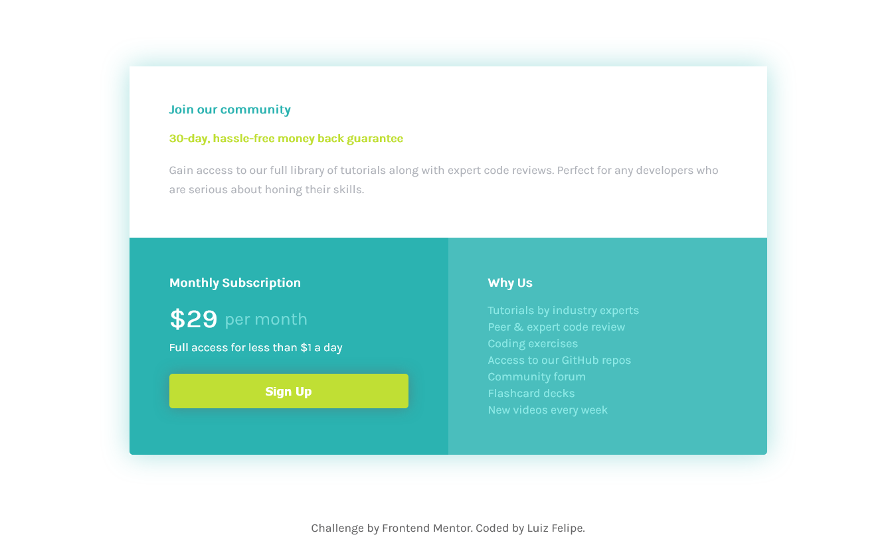

# Frontend Mentor - Single price grid component solution

This is my solution to the [Single price grid component challenge on Frontend Mentor](https://www.frontendmentor.io/challenges/single-price-grid-component-5ce41129d0ff452fec5abbbc). You can access the live site [here](https://lufesipe.github.io/Single-price-grid-component/).

Frontend Mentor challenges help you improve your coding skills by building realistic projects. 

## Table of contents

- [Overview](#overview)
  - [The challenge](#the-challenge)
  - [Screenshot](#screenshot)
- [My process](#my-process)
  - [Built with](#built-with)
  - [What I learned](#what-i-learned)
  - [Continued development](#continued-development)
  - [Useful resources](#useful-resources)
- [Author](#author)
- [Acknowledgments](#acknowledgments)


## Overview

### The challenge

In this challenge users should be able to:

- View the optimal layout for the component depending on their device's screen size
- See a hover state on desktop for the Sign Up call-to-action

### Screenshot

Below there are two screenshots from the project. The first is the visualization if you're using a desktop and the second is the view from a mobile device.



<center>Desktop view screenshot</center>


<center>Mobile view screenshot</center>

## My process

### Built with

- HTML5
- CSS
- Flexbox and Grid

### What I learned

I started the challenge with the elements in the HTML. At this moment, I decided to use a CSS grid to build this solution due to the bi-dimensional design from the desktop view.

Then I went to the CSS and learned something new as soon as I started. I never had added an external font to my style before so I was happy when I discovered how to do this:

```css
@import url(https://fonts.googleapis.com/css2?family=Karla);
```

I still don't know exactly the best workflow, but I decided to style the mobile design first and then add media queries to the desktop design. Also, I wrote the selectors in order up to the bottom.

As a beginner, it was my first time using a CSS grid in a project, so I liked when I texted this and got the exactly right design:

```css
#main_container{
        display: grid;
        grid-template-columns: 50% 50%;
        margin: 85px 50px;
        max-width: 960px;
    }
    #join_div {
        grid-column: 1/3;
	}
```

One more thing I was proud of with the visual result was the lines below. Here I used an <span> in my HTML to divide the text in the same line and then gave different styles and used flexbox to center both vertically.

```html
<p class="price"><span>&dollar;29</span>per month</p>
```

```css
.price{
    margin: 20px 0 10px 0;
    display: flex;
    align-items: center;
    color: #77DBD9;
}
span{
    font-size: 30px;
    font-weight: 700;
    color: white;
    padding-right: 10px;
}
```

For the future I want to continue focusing on how to get more responsivity in a easier way and learn more about grid and flexbox concepts and use.

### Useful resources

- [CSS Grid and Flexbox video](https://www.youtube.com/watch?v=x-4z_u8LcGc&t=1085s) - This lesson on YouTube helped me to understand the difference between Grid and Flexbox and when to use each one. But the video is in Portuguese.
- [StackOverflow](https://stackoverflow.com/) - With this site, I could solve some specific questions. So I also recommend getting a look at this type of forums before asking some questions.

## Author

- GitHub - [lufesipe](https://github.com/lufesipe)
- Frontend Mentor - [@lufesipe](https://www.frontendmentor.io/profile/lufesipe)
